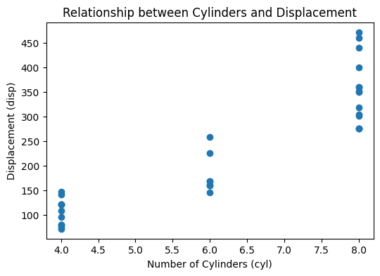
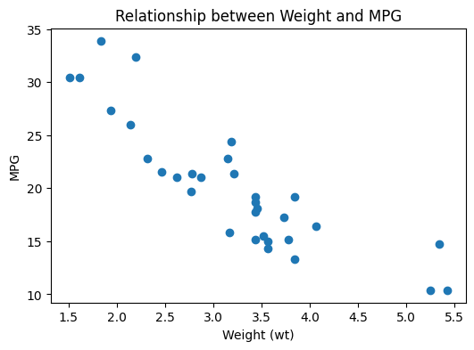

---

# 🚀 팀 미션 기록지: [Week1]

## 👥 팀 구성원

* **팀원:** 김용진(Albert), 김지원, 유용선, 홍준성

---

## 📅 W1M1: mtcars 데이터셋 분석

### 1. 비즈니스 가치 분석

> **질문:** 이 데이터셋을 분석해서 얻을 수 있는 경제적 가치? 어떤 비즈니스 상황에서 활용할 수 있을까요?

* **분석 내용:**
자동차 데이터 분석은 자사 차량의 특성을 이해하는 데 그치지 않고, 경쟁사 차량과의 비교 분석에도 활용될 수 있습니다. 예를 들어 경쟁사 차량 데이터에서 연비(mpg), 마력(hp), 배기량(disp), 무게(wt) 사이의 상관관계를 분석하면, 해당 기업이 연비 중심 설계를 했는지, 고성능 중심 설계를 했는지와 같은 상품 전략을 추론할 수 있습니다. 이후 이를 자사의 유사 차종과 비교하면, 동일한 차급에서 어떤 요소가 더 강점인지 혹은 부족한지 파악할 수 있습니다. 이러한 분석은 차량 설계 개선, 옵션 구성 조정, 마케팅 포인트 발굴, 경쟁 차종 대응 전략 수립 등으로 이어질 수 있으며, 궁극적으로는 판매 경쟁력 강화라는 경제적 가치를 가집니다.

### 2. 상관관계 분석

> **질문:** 변수 간 상관관계가 높은 조합 2개를 선택, 그래프 도출 및 결론을 논의하세요.

* **조합 1: [disp(배기량)] vs [cyl(실린더 수)]**
* **결론:** disp와 cyl은 강한 양의 상관관계를 보입니다. 이는 실린더 수가 많을수록 배기량이 큰 경향이 있음을 의미합니다. 일반적으로 실린더 수가 증가하면 엔진의 전체 배기량도 함께 증가하여 더 높은 출력과 성능을 낼 수 있습니다.

* **조합 2: [mpg(연비)] vs [wt(차량 무게)]**
* **결론:** mpg와 wt는 강한 음의 상관관계를 보입니다. 이는 차량 무게가 증가할수록 연비가 감소하는 경향이 있음을 의미합니다. 차량이 무거울수록 더 많은 에너지가 필요하므로 연료 소비가 증가하며, 연비 개선을 위해서는 차량 경량화가 중요합니다.

---

## 📚 W1M2: SQL Tutorial

### 1. 핵심 키워드 체크

> **질문:** 각자 이해하기 어렵거나 추가 학습이 필요한 키워드를 공유하고 토의합니다.

| 이름 | 키워드 | 토의 내용 및 결론 |
| --- | --- | --- |
| **김용진** | `ANY / ALL`, `SELF JOIN` | 서브쿼리 비교 방식(ANY/ALL) 및 동일 테이블 간 관계 비교(SELF JOIN)의 특성과 사용법을 학습함. |
| **유용선** | `STORED PROCEDURE`, `NULL Function` | 특정 로직의 함수화 및 다양한 SQL 환경에서의 NULL 값 처리 방법을 익힘. |
| **김지원** | `SELECT 표현식` | SELECT문에서 컬럼뿐만 아니라 상수, 함수, 계산식, CASE문 등을 자유롭게 활용할 수 있음을 확인. |
| **홍준성** | `DBMS 호환성` | SQLite 실습을 통해 DBMS마다 문법 지원 범위가 다를 수 있음을 체감하고 공식 문서 확인의 중요성을 깨달음. |

---

## ⚙️ W1M3: ETL 프로세스 구현

### 1. 데이터 소스 확장

> **질문:** IMF 홈페이지 데이터 수집 방법 및 전략

* **수집 방법:** IMF는 공식 데이터 API를 제공하므로, Wikipedia를 직접 크롤링 하지 않고도 API를 통해 데이터를 수집하는 것이 가능합니다. 데이터의 정확성과 최신성을 유지하기 위해 공식 API를 사용하는 방식이 더 적합합니다.

> **질문:** 데이터 갱신 시 과거 데이터 처리 방안 및 ETL 프로세스 변경점

* **ETL 프로세스 변경사항:** 최신 데이터만 남기는 방식은 과거 추이 분석이 어렵기 때문에 **ELT(Extract, Load, Transform)** 방식을 적용하는 것이 좋습니다. 원본 데이터를 먼저 적재한 후 필요한 시점에 변환을 수행하면, 원본이 보존되어 변환 오류 대응이나 향후 분석 기준 변경에 유연하게 대처할 수 있습니다. 따라서 과거 데이터 조회가 필수적인 경우, 누적 저장 후 재가공하는 ELT 구조가 훨씬 효과적입니다.