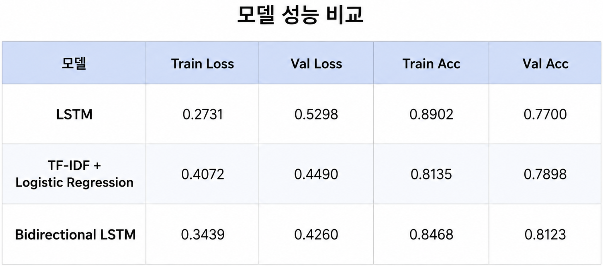
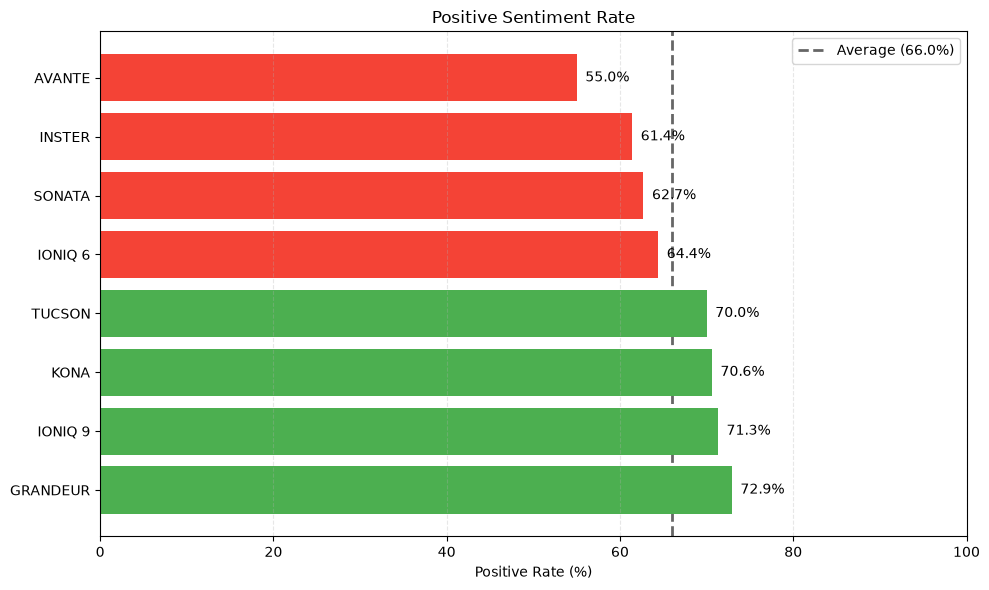
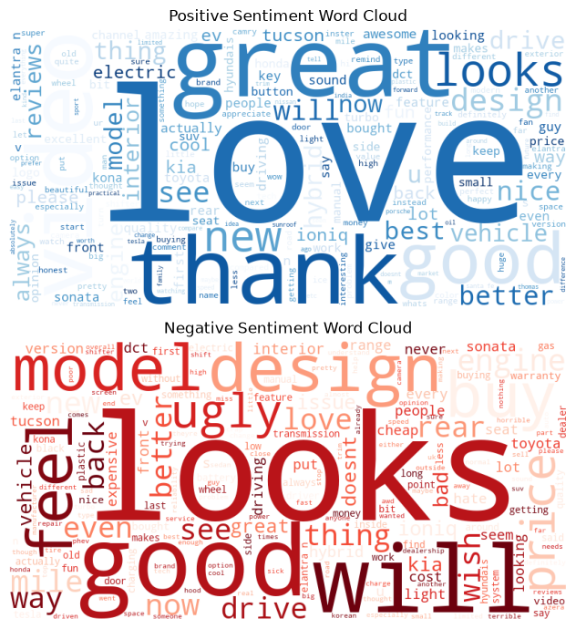

# W2M5 팀 활동: 현대자동차 유튜브 댓글 기반 차종별 감정분석

## 1. 프로젝트 개요

본 프로젝트의 목표는 현대자동차 관련 유튜브 댓글을 웹스크래핑으로 수집하고, 감정분석 모델을 적용하여 분석하는 것이다.

특히 **IONIQ 9, IONIQ 6, AVANTE, SONATA, TUCSON, KONA, SONATA, INSTER 의 개별 차종에 대한 소비자 반응 차이**를 보는 것이 핵심이다.

SUV와 Sedan의 전반적인 경향을 확인할 수는 있지만, 실제 비즈니스적 의사결정에는 구체적인 차종 단위의 반응이 더 직접적으로 활용될 수 있다.

분석 흐름은 다음과 같다.

```text
1. Sentiment140 dataset으로 모델 학습
2. 팀원별 감정분석 모델 성능 비교
3. 현대자동차 유튜브 댓글 웹스크래핑
4. 스크래핑 댓글에 감정 라벨 추가
5. car_name별 긍정/부정 비율 비교
6. 긍정/부정 word cloud
7. 비즈니스 관점의 결론 도출
8. 한계점 및 개선 방향
9. 결론
```

---

## 2. 데이터 수집

### 2.1 학습 데이터

모델 학습에는 Sentiment140 감정분석 데이터셋을 사용하였다. 해당 데이터는 문장과 감정 라벨로 구성되어 있으며, 라벨은 다음과 같다.

| 라벨 | 의미 |
|---:|---|
| 0 | Negative |
| 4 | Positive |

해당 데이터에는 중립 라벨이 존재하지 않기 때문에, 기본 모델은 긍정/부정 이진 분류 모델로 학습되었다.
후속 단계에서 중립 라벨에 대한 구체적인 논의를 진행하였다.

### 2.2 분석 데이터

분석 대상 데이터는 현대자동차 차종별 유튜브 영상 댓글이다. 과제 요구사항에 맞추기 위해 YouTube API가 아니라 **웹스크래핑 방식**으로 댓글 데이터를 수집하였다.

수집한 주요 컬럼은 다음과 같다.

| 컬럼명 | 설명 |
|---|---|
| `car_name` | 개별 차종명 |
| `car_type` | 차종 유형, SUV 또는 Sedan |
| `author` | 댓글 작성자 |
| `text` | 댓글 본문 |
| `like_count` | 댓글 좋아요 수 |
| `sentiment` | 모델이 예측한 감정 라벨 |

이번 프로젝트에서는 `car_name`을 핵심 분석 단위로 사용하였다. `car_type`은 SUV와 Sedan의 큰 흐름을 보기 위한 보조 지표로만 사용하였다.

---

## 3. 모델 학습 및 비교

각 팀원은 Twitter 감정분석 데이터를 기반으로 서로 다른 감정분석 모델을 학습하였다.

모델 비교를 위해 각 모델의 학습 과정에서 epoch별 성능 지표를 CSV로 저장하였다.

저장한 지표는 다음과 같다.

| 지표 | 의미 |
|---|---|
| `train_acc` | 학습 데이터 정확도 |
| `val_acc` | 검증 데이터 정확도 |
| `train_loss` | 학습 데이터 손실 |
| `val_loss` | 검증 데이터 손실 |


모델 학습 결과는 다음과 같다: 


모델 평가는 단순히 train accuracy가 높은 모델을 선택하지 않고, 다음 기준을 함께 고려하였다.

```text
1. validation accuracy가 높은가?
2. validation loss가 낮은가?
3. train accuracy와 validation accuracy의 차이가 작은가?
4. epoch이 진행될수록 validation loss가 불안정하게 증가하지 않는가?
```

즉, 학습 데이터에만 잘 맞는 모델이 아니라 새로운 데이터에도 일반화 성능이 좋은 모델을 선택하고자 하였다.

### 3.1 모델 비교 결과

팀원별 모델의 epoch별 성능을 비교한 결과, 최종 분석에는 **Bidirectional LSTM 모델**을 사용하였다.

선정 근거는 다음과 같다.

```text
- validation accuracy가 상대적으로 높았다.
- validation loss 기준으로 안정적인 학습 흐름을 보였다.
- Bidirectional LSTM 구조를 사용하여 문장 앞뒤의 문맥을 함께 반영할 수 있었다.
- 유튜브 댓글처럼 길이가 길고 문맥이 섞인 문장에 더 적합하다고 판단하였다.
```


---

## 4. 댓글 감정 라벨링

학습된 모델을 이용하여 웹스크래핑한 유튜브 댓글에 감정 라벨을 추가하였다.

기본 학습 데이터에는 긍정과 부정 라벨만 존재했기 때문에, 유튜브 댓글의 정보성 문장을 처리하기 위해 중립 라벨을 후처리로 추가하였다.

모델의 positive probability를 기준으로 다음과 같이 라벨을 부여하였다.

| 조건 | 라벨 |
|---|---|
| probability ≤ 0.4 | Negative |
| 0.4 < probability < 0.6 | Neutral |
| probability ≥ 0.6 | Positive |

### 4.1 중립 라벨
중립 라벨을 추가한 이유는 유튜브 댓글에는 다음과 같은 정보성 댓글이 많이 포함되어 있기 때문이다.

```text
- 가격 정보
- 차종 비교
- 기능 설명
- 질문성 댓글
- 단순 사실 전달 댓글
```

이러한 댓글을 무조건 긍정 또는 부정으로 분류하면 실제 소비자 감정 해석이 왜곡될 수 있기 때문에, 확률 기반 threshold를 이용하여 중립 구간을 설정하였다.

---

## 5. car_name별 감정분석 결과

분석 대상 차종은 다음과 같다.

```text
IONIQ 9
IONIQ 6
AVANTE
SONATA
TUCSON
KONA
INSTER
SONATA
```

각 차종별로 positive, neutral, negative 댓글 수를 집계하고, 전체 댓글 수 대비 비율을 계산하였다.

```text
차종별 긍정 비율 = 해당 차종 positive 댓글 수 / 해당 차종 전체 댓글 수
차종별 부정 비율 = 해당 차종 negative 댓글 수 / 해당 차종 전체 댓글 수
```

이 기준으로 가장 긍정적인 차종과 가장 부정적인 차종을 선정하였다.




### 5.1 가장 긍정적인 차종

분석 결과, 가장 긍정적인 반응을 보인 차종은 **IONIQ 9**이었다.

```text
IONIQ 9 긍정 비율: 71.3%
```

이는 IONIQ 9에 대한 유튜브 댓글에서 긍정적 반응이 상대적으로 높게 나타났음을 의미한다.

### 5.2 가장 부정적인 차종

분석 결과, 가장 부정적인 반응을 보인 차종은 **AVANTE**였다.

```text
AVANTE 부정 비율: 43.5%
```

이는 AVANTE 관련 댓글에서 부정적 반응이 다른 차종에 비해 상대적으로 높게 나타났음을 의미한다.

---

## 6. WordCloud 기반 키워드 분석



---

## 7. 비즈니스적 해석

이번 분석을 통해 개별 차종별 소비자 반응 차이를 정량적으로 비교할 수 있었다.

가장 긍정적인 반응을 보인 IONIQ 9의 경우, 댓글에서 자주 등장한 긍정 키워드를 바탕으로 마케팅 포인트를 강화할 수 있다.

예를 들어 다음과 같은 방향으로 활용할 수 있다.

```text
- 소비자가 긍정적으로 반응한 디자인 요소 강조
- SUV 공간성 및 패밀리카 이미지 강화
- 전기차 신차 기대감을 활용한 광고 문구 구성
```

반대로 부정 비율이 높았던 ELANTRA의 경우, 부정 댓글에서 자주 등장한 키워드를 통해 개선이 필요한 지점을 파악할 수 있다.

```text
- 반복적으로 언급되는 불만 요소 확인
- 디자인, 가격, 성능 관련 소비자 반응 분석
- 향후 상품 개선 또는 커뮤니케이션 전략에 반영
```

즉, 감정분석 결과는 단순한 긍정/부정 분류를 넘어서, 차종별 소비자 인식과 개선 포인트를 찾는 데 활용될 수 있다.

---

## 8. 한계점

이번 프로젝트에는 몇 가지 한계가 존재한다.

첫째, 학습 데이터와 분석 데이터의 도메인이 다르다.

```text
학습 데이터: Twitter 댓글
분석 데이터: YouTube 자동차 댓글
```

Twitter 댓글은 짧고 감정 표현이 직접적인 경우가 많지만, YouTube 자동차 댓글은 정보성 문장, 질문, 가격 비교, 농담 등이 많이 포함되어 있다. 이로 인해 정보성 댓글이 긍정 또는 부정으로 잘못 분류될 가능성이 있다.

둘째, 학습 데이터에는 중립 라벨이 존재하지 않는다. 따라서 중립은 모델이 직접 학습한 라벨이 아니라, positive probability threshold를 이용한 후처리 결과이다.

셋째, 웹스크래핑 데이터는 영상 선택에 따라 편향될 수 있다. 특정 유튜버나 특정 영상의 댓글 분위기가 전체 차종 반응을 대표한다고 보기는 어렵다.

넷째, `car_name`별 댓글 수가 완전히 동일하지 않을 수 있다. 따라서 단순 댓글 수가 아니라 비율을 기준으로 비교해야 한다.

---

### 8.1 개선 방향

향후에는 다음과 같은 방식으로 프로젝트를 개선할 수 있다.

```text
1. 자동차 리뷰 댓글에 특화된 데이터셋 확보
2. 중립 라벨이 포함된 3분류 감정분석 데이터 사용
3. 수동 검수 샘플을 이용한 실제 정확도 평가
4. 영상 수를 늘려 차종별 데이터 편향 완화
5. car_name별 댓글 수를 균형 있게 수집
6. 긍정/부정 키워드를 카테고리화하여 더 구체적인 인사이트 도출
```

특히 유튜브 댓글 중 일부를 사람이 직접 검수하여 모델 예측 결과와 비교하면, 실제 분석 데이터 기준의 모델 정확도를 더 객관적으로 평가할 수 있다.

---

## 9. 결론

본 프로젝트에서는 Twitter 감정분석 데이터를 기반으로 감정분석 모델을 학습하고, 웹스크래핑으로 수집한 현대자동차 유튜브 댓글에 적용하였다.

즉, **개별 차종명인 `car_name` 기준의 반응 차이**를 중요하게 보았다. 그 결과, IONIQ 9은 가장 긍정적인 반응을 보인 차종, 아반떼는 가장 부정적인 반응을 보인 차종으로 나타났다.

또한 긍정 차종의 장점 키워드와 부정 차종의 단점 키워드를 추출함으로써, 감정분석 결과를 비즈니스적 의사결정에 활용할 수 있는 가능성을 확인하였다.

이번 프로젝트는 실제 웹 데이터를 수집하고, 모델을 적용하고, 결과를 해석하여 **개별 차종별 소비자 반응을 분석한 데이터 파이프라인 실습**이라는 점에서 의미가 있다.
