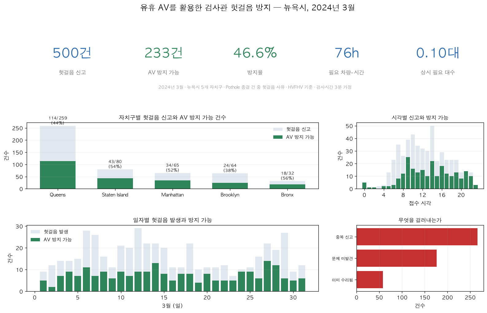
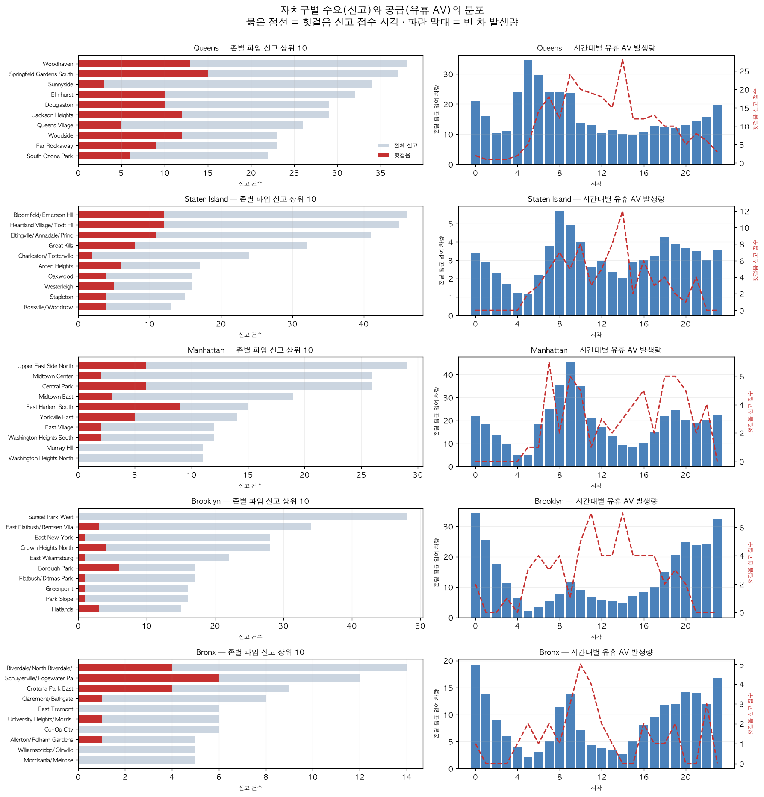
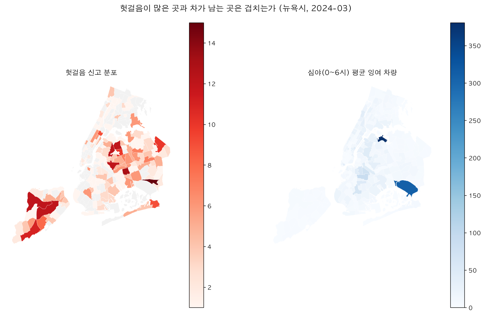

# 자율주행 택시를 활용한 포트홀 탐지

## 1. 사업 제안

귀사의 매출이 발생하지 않는 대기 시간의 자율주행(AV) 택시를 미검증 311 포트홀 신고를 확인해주는 대가로 수익과 규제 신뢰를 얻는 채널로 전환하는 제안이다.
오프피크 시간대에 차량이 차고지에 서 있거나 빈 차로 배회하는 시간, 운영비는 계속 나가지만 매출은 0이다. 이 시간을 그대로 두는 대신, 뉴욕시가 이미 골머리를 앓고 있는 문제 하나를 해결해주고 그 대가를 받는 구조를 제안한다.

## 2. 개요

### 2.1. 대상

자율주행 택시 운영업체의 차량 관리팀 담당자

### 2.2. 해결 과제

택시 운행이 없는 대기 시간 동안의 수익화

### 2.3. 해결 방법

택시의 운행 대기 시간 동안 포트홀(Pothole) 신고의 검증에 활용

### 2.4. 기대효과

- **검증 건당 수수료** — 도시로부터 직접 받는 현금 수익
- **규제·라이선스 협상 크레딧** — 향후 운행 허가 협상에서 유리하게 작용
- **노면 데이터 자산** — 검증 과정에서 축적되는 고해상도 노면 데이터

## 3. 현 상황

오프피크 시간대의 자율주행 택시는 운영비만 계속 나가고 매출은 0인 순손실 상태로 방치된다. 한편 뉴욕시 DOT는 매년 6만 건 이상의 311 포트홀 신고를 검사관이 직접 현장에 나가 검증하는데, 이 중 21.3%는 중복, 기수리, 비조치 대상인 "헛걸음"이다. 결국 운영사는 놀리는 자산에서 손실을 보고, 도시는 처리할 것 없는 곳에 검증 자원을 낭비하고 있다.

| 구분 | 대기 상태로 방치 | 본 제안 적용 |
| :--- | :--- | :--- |
| 운영비 | 계속 발생(손실) | 동일(어차피 발생) |
| 매출 | $0 | 검증 수수료 발생 |
| 데이터 | 없음 | 노면 데이터 축적 |
| 규제 관계 | 변화 없음 | 협상 크레딧 확보 |

## 4. 서비스 제안 방식

### 4.1 빈 시간대 식별 및 배차

- 도시(DOT)가 미검증 포트홀 신고 좌표를 매년 6만건 이상 운영사에 전달
- 운영사는 시간대, 구역을 파악해, 대기하는 AV의 경로에 검증 지점을 우회(detour)로 삽입

### 4.2 현장 스캔

- 자율주행 택시가 해당 좌표를 지나며 라이다, 다중 카메라로 노면을 정밀 기록
- 사람이 운전하는 차량과 달리, 별도 인력 투입 없이 통과만으로 고해상도 데이터 확보

### 4.3 자동 판정

- 수집된 데이터로 포트홀 존재 여부와 규격(지름 1피트·깊이 3인치 기준)을 자동 분류
- 실재 / 헛걸음(중복·기수리·경미) 판별 → 필요 시 사람 리뷰로 보정

### 4.4 결과 회신

- 판정 결과를 도시에 데이터로 전송
- 도시는 "실재" 건만 보수 우선순위에 반영하고, "헛걸음" 건은 현장 출동 없이 자동 종결

## 5. 비즈니스 수익 모델

| 모델 | 지불 주체 | 형태 | 제시 단가/가치 | 설명 |
| :--- | :--- | :--- | :--- | :--- |
| 검증 건당 수수료 | 도시(DOT) | 현금 | 건당 $15~$30¹ | 유효 검증 1건당 과금. 현행 검증 단가($40~$80)보다 확실히 낮게 책정 |
| 규제 크레딧 | 운영사 ↔ 도시 | 비현금 | 협상 레버리지로 환산 | 당국과 허가 협상 시 신뢰 및 안전 실적으로 환산. |
| 노면 데이터 자산 | 운영사(내부) | 간접 가치 | 데이터 취득원가 절감분 | 검증 과정 동안 축적되는 고해상도 노면 데이터를 모델 고도화에 활용 가능 |

문서의 뉴욕 3월 분석 기준, 월 233건 기준 예상 수익은 다음과 같다.

| 건당 단가 | 월 233건 기준 매출 | 연 환산(단순 ×12) |
| :--- | :--- | :--- |
| $15 (하한) | 약 $3,495 | 약 $42,000 |
| $30 (상한) | 약 $6,990 | 약 $84,000 |

## 6. 분석 결과 (2024년 3월, 뉴욕시)

헛걸음 신고의 절반 가까이(46.6%)를, 도시 전체 유휴 차량 자원의 0.0013%도 안 되는 양으로 커버할 수 있다.

### 6.1. 핵심 지표

| 지표 | 값 |
| :--- | :--- |
| 시 전체 Pothole 종결 신고 | 2,349건 |
| 그중 헛걸음 확정 신고 | 500건 (21.3%) |
| AV로 방지(대체 검증) 가능 | 233건 (46.6%) |
| 필요 자원 ÷ 총 유휴 발생량 | 0.0013% |

(분석 방법론은 [각주]를 참고)

### 6.2. AV로 얼마나 대체하는가

### 6.3. 자치구별 상세

- 0-2시, 21-23시 등 심야·오프피크 시간대는 방지율이 100%에 근접한다.
- 반대로 새벽 5~7시는 신고가 몰리는데(방지율 13~23%) 이 시간대 유휴 공급이 상대적으로 부족해, 방지율이 하루 중 가장 낮다.

### 6.4. 헛걸음 신고 분포 vs 심야 유휴 차량 분포

- 신고가 몰리는 존과 밤에 차가 남는 존이 서로 다르다. 그래서 마침 그 자리에 있던 차를 쓰는 방식으로는 부족하고, 차를 그쪽으로 보내는 배차가 필요하다.

## 7. 결론

### 7.1 자치구별 결과

| 자치구 | 전체 신고 | 헛걸음 | 헛걸음률 | AV 방지 가능 | 방지율 |
| :--- | :--- | :--- | :--- | :--- | :--- |
| Queens | 848 | 259 | 30.5% | 114 | 44.0% |
| Staten Island | 344 | 80 | 23.3% | 43 | 53.8% |
| Manhattan | 398 | 65 | 16.3% | 34 | 52.3% |
| Brooklyn | 592 | 64 | 10.8% | 24 | 37.5% |
| Bronx | 166 | 32 | 19.3% | 18 | 56.3% |

### 7.2 우선 파일럿 지역: Queens

Queens는 헛걸음 신고량 자체가 가장 많지만(전체의 52%) 방지율(44.0%)은 가장 낮은 축에 속한다. 존 면적이 넓어 존내 이동시간이 길다.

신고량이 최다이면서 방지율은 최저이므로 개선 여지가 가장 큰 지역이며, 배차 최적화가 더해질 경우 성과 상승 폭도 가장 크다.

Queens에서 방지 가능한 헛걸음은 월 114건으로, 본 제안의 검증 수수료($15~$30/건)를 적용하면 예상 수익은 다음과 같다.

| 건당 단가 | Queens 월 매출(114건) | 연 환산(단순 ×12) |
| :--- | :--- | :--- |
| $15 (하한) | 약 $1,710 | 약 $20,520 |
| $30 (상한) | 약 $3,420 | 약 $41,040 |

### 7.3 로드맵

우선 Queens를 1차 파일럿으로 검증하고, 이어서 방지율이 가장 높은 **Bronx(56.3%)·Staten Island(53.8%)**를 후속 후보로 확대 검토한다. 개선 여지가 최대인 지역에서 배차 모델을 먼저 다지고, 방지율이 이미 높은 지역으로 넓혀 안정적 성과를 확보하는 순서다.

---

## [각주] 분석 방법

| 구분 | 내용 |
| :--- | :--- |
| 분석 대상 기간 | 2024년 3월 한 달 |
| 분석 범위 | 뉴욕시 5개 자치구 · 택시 존 263개 |
| 공급(유휴 AV) 데이터 | HVFHV(Uber/Lyft) 트립 기록 |
| 수요(헛걸음 신고) 데이터 | 311 신고 데이터 중 descriptor = Pothole, status = Closed 건 |
| 헛걸음 판정 기준 | 종결 사유(resolution) 텍스트에 "중복 신고 / 문제 미발견 / 이미 수리됨 / 기준 부합(비위험) / 소관 아님 / 타 부서 이관" 등의 문구가 포함된 경우 |
| 존내이동 시간 산출 | 각 zone에서 pickup·dropoff가 모두 발생한 트립들의 소요시간 중앙값(실측 기반) |
| 검증 소요시간 가정 | 건당 3분 |
| 소요 자원 계산 대상 | AV로 방지 가능(coverable=1)한 233건만 집계 |

### 참고 사항

- 3월은 겨울철 결빙·해빙 이후 포트홀 발생이 급증하는 시기로 알려져 있어, 오히려 검증 수요가 큰 달을 기준으로 분석했다. 즉 본 결과는 연중 평균보다 다소 보수적인(수요가 높은) 시나리오에 가깝다.
- 공급 데이터로 옐로캡 대신 HVFHV를 사용한 이유: 옐로캡은 맨해튼 밖 운행이 드물어 5개 자치구 전역 분석에 부적합
